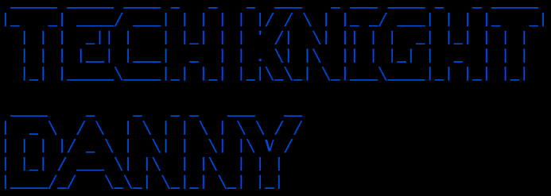

  

  
  
  

### Hi there 👋

- 🔭 I’m currently working on Projects relevant to Automation
- 👯 I’m looking to collaborate on any proof-of-concepts relevant to Automation of Boring, tedious and dreary tasks
- 😄 Pronouns: He / Him / His
- ⚡ Favorite Quote: `Do or Die Trying...`
